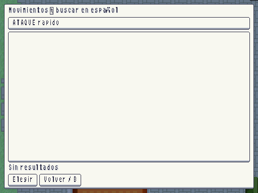
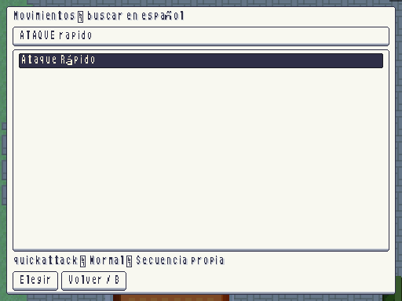

# Menú F9 · mando y búsquedas

Se reproducían dos fallos: mando A no activaba los botones nativos; «ataque rapido»/«puno fuego» no encontraban los nombres con tildes. `ui_accept` incluye A; la búsqueda normaliza acentos, mayúsculas y espacios y exige todas las palabras. Un catálogo solo devuelve una selección por apertura. Las tres regresiones usan los controles y datos reales.

| Antes: búsqueda sin resultados | Después: Ataque Rápido |
|---|---|
|  |  |
