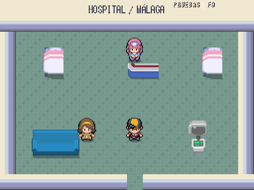
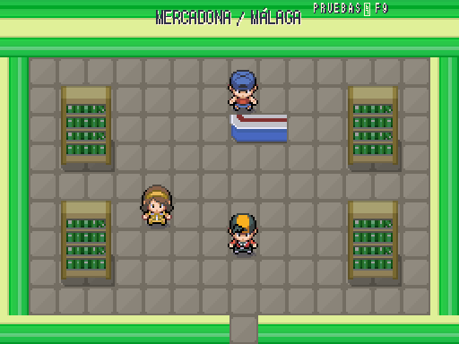
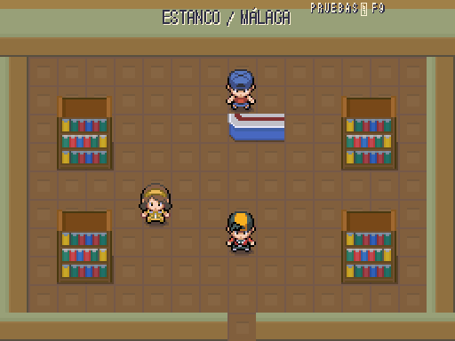

# Málaga · Locales jugables

| Referencia de estilo · Añil | Hospital · juego real 512×384 |
|---|---|
|  |  |

| Mercadona · 512×384 | Estanco · 512×384 |
|---|---|
|  |  |

Interiores nuevos con muebles y suelos originales de Akizakura16; sin arte generado por código. Dos camas y sala de espera, recepción con curación y punto de recuperación, terminal de PC; tiendas con dos pasillos, caja y compra/venta reales. Fuente y recortes: [interiores](../interiores.md).

Cómo revisarlos: F9 → Entrar en sesión → Mundo → Málaga / hospital, mercadona o estanco; también se entra andando desde el exterior. Hospital en (29,21), Mercadona (48,20), estanco (55,21); cada salida devuelve a la casilla de la calle inmediatamente al sur. La fachada hospitalaria es un edificio urbano genérico del pack, provisional; el rótulo ya dice Hospital. No se ha elegido un hospital real ni inventado su geografía.

Mercadona conserva el stock por medallas de la tienda existente. Estanco ofrece objetos X con precios de DataDB e iconos originales del Generation 9 Pack. Sin lotería, sellos ni sesiones de Basic-Fit: requieren decisiones/API propias. Se conservan los mapas/encuentros, los entrenadores y el enlace al Torcal.

Pruebas nuevas: puertas de ida/vuelta sin bucles, interacción a través del mostrador, curación de PS/estado/PP, recuperación tras derrota, apertura/cierre del PC y compra con precios/stock reales. F9: mando A y búsquedas sin tildes con elección única.

Arte **provisional, pendiente Javier**. No hay referencia de interiores de Añil en el repo: la imagen de pueblo sirve para escala y coherencia de estilo; no se afirma aprobación de nivel gráfico.

Validación: **478/478 tests, 19.645 aserciones, 432,89 s**; arte **10.926 PNG, 0 errores/avisos**; datos **0 errores, 3 avisos previos**. Alcance exterior y de los tres interiores: 0 problemas.
