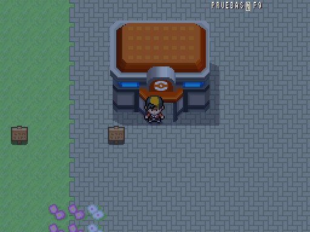
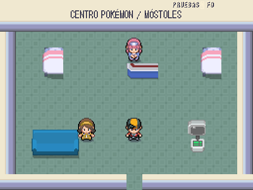
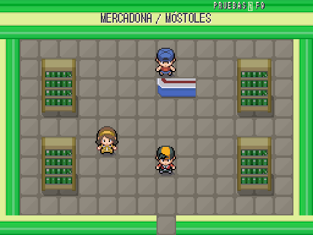
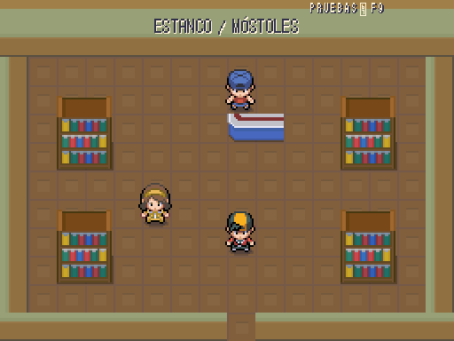

# Móstoles: interiores de servicios · 2026-10-10

**PROVISIONAL — pendiente de revisión de Javier.** Tres locales jugables en los edificios ya pintados: Centro Pokémon, Mercadona y estanco. Se conserva el Centro en estas localidades sin gimnasio; los hospitales sustituyen al Centro en las ocho ciudades con gimnasio.

| Referencia de escala y acabado del mundo | Fachada existente y entrada conectada |
|---|---|
|  |  |

La referencia es de exterior: sirve para contrastar escala y acabado del mundo, **no acredita la aprobación del interior**. No hay una referencia de interior de Añil en el repositorio. Composición con las piezas originales de Akizakura16, casillas de 32 px sin reescalar ni arte procedural.

| Centro Pokémon | Mercadona | Estanco |
|---|---|---|
|  |  |  |

Capturas reales a **512×384**. Centro con enfermería, curación de PS/estado/PP, PC y recuperación tras derrota en (8,5). Las tiendas abren su interfaz real, con existencias por medallas y precios de DataDB. No se añaden lotería, sellos ni reglas de Basic-Fit.

Acceso: puertas del exterior `mostoles/exterior`, o F9 → viajar al mapa → `mostoles/centro`, `mostoles/mercadona` y `mostoles/estanco`. La salida conserva el exterior y sitúa al jugador una casilla al sur de la puerta para evitar bucles. Las conexiones y el Cercanías existentes se conservan. Carteles de los tres locales actualizados; otros interiores siguen pendientes.

Verificación: alcance de los cuatro mapas **0 problemas**, doce parejas de puertas del tramo probadas en juego, curación/derrota/PC y compra real probados en las cuatro localidades. Arte pendiente de revisión; este conjunto reutiliza el mobiliario sanitario provisional y no pretende representar la arquitectura de un hospital real.
