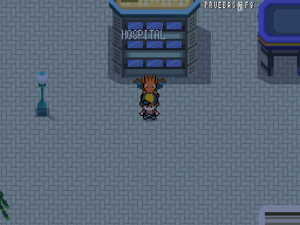

# Valencia · Interiores de servicios

| Referencia de estilo · Añil | Fachada hospitalaria provisional · 512×384 |
|---|---|
|  |  |

| Hospital · curación y PC | Mercadona · compra/venta | Estanco · objetos X |
|---|---|---|
|  |  |  |

Tres interiores 16×12, con recursos nativos de Akizakura16; mismo conjunto funcional validado en [Málaga](malaga_locales.md). [Origen y reproducción](../interiores.md). Hospital con camas, recepción, curación de PS/estado/PP, PC y recuperación tras derrota; Mercadona con stock por medallas; estanco con objetos X y precios de DataDB. Sin nuevas reglas de lotería ni entrenamiento.

| Local | Exterior de entrada | Anclaje del edificio | Interior en F9 |
|---|---|---|---|
| Hospital | `valencia/ciutat_vella` | (48,24) | `valencia/hospital` |
| Mercadona | `valencia/ciutat_vella` | (48,38) | `valencia/mercadona` |
| Estanco | `valencia/ciutat_vella` | (56,24) | `valencia/estanco` |

Puertas reales comprobadas y vuelta al mismo barrio, una casilla al sur de la puerta, sin reentrada. Se conserva el resto del pintado, vecinos, encuentros y conexiones. El hospital sustituye el Centro de este conjunto; Centros/tiendas adicionales de otros barrios siguen pendientes de interiores. Fachada urbana genérica con rótulo, **provisional, pendiente Javier**; no representa un hospital real seleccionado.

F9 → sesión separada → Mundo → interior correspondiente; también se puede entrar andando desde la calle. Referencia de Añil disponible en el repo: pueblo, para escala y coherencia; no hay referencia interior ni aprobación gráfica de esta entrega.

Validación conjunta: **479/479 tests, 19.978 aserciones, 467,06 s**. Arte: **10.926 PNG, 0 errores/avisos**. Datos: **0 errores, 3 avisos anteriores**. Regresión real de 21 parejas de puertas entre siete ciudades, 190 aserciones de servicios; curación/PC/compras reales en sus propias pruebas.
